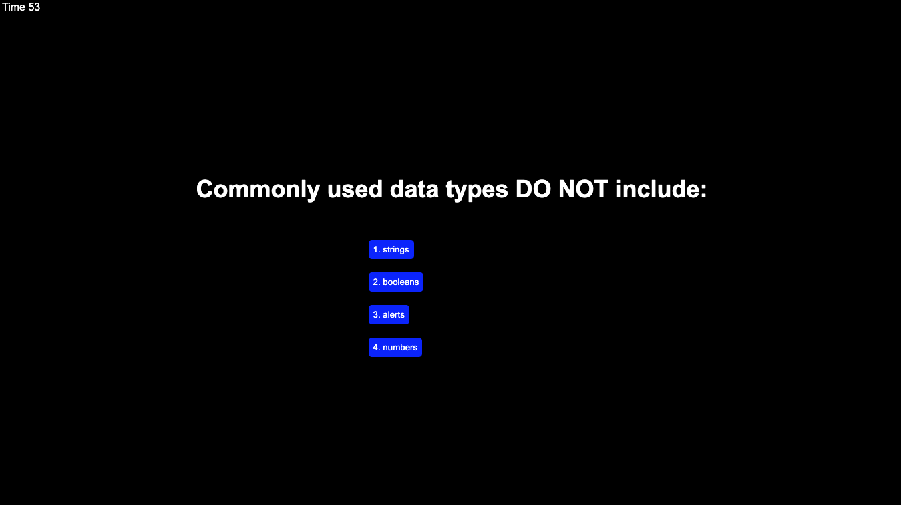
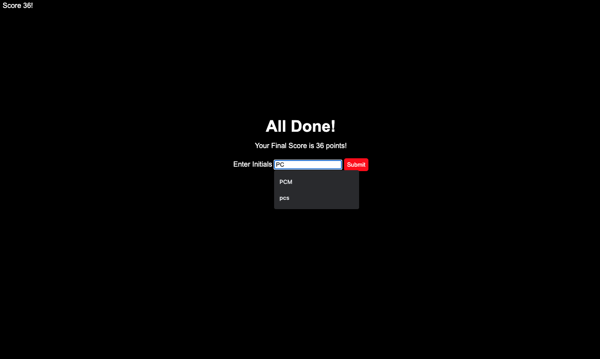
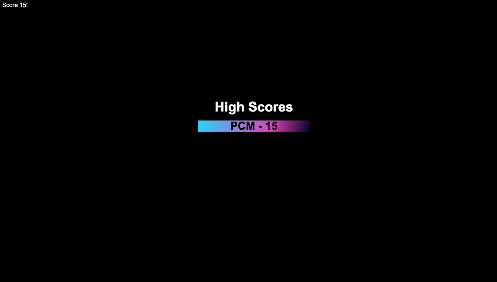

# Coding Quiz Challenge

## Description

For this project I made a quiz that asks pretty simple questions about web development as a timer counts down in the back. If the user answers a question wrong than the countdown is reduced by 10. The quiz is over when either the user finishes all 5 questions or the timer hits 0. Then the high score can be saved in the local storage. I built this project so that I could build my DOM manipulation skills and logic while allowing the user to play a fairly boring game. I hope that the user learns a few things about javascript after answering the five questions. It was helpful to me because I learned that next time I really have to try and keep my code in check, it was definitely spaghetti by the time I was done. I also, learned about local storage and prevent defaults.

You can link to the quiz here [HERE](https://petermodavis.github.io/coding-quiz-challenge/)

## Installation

Simply visit the link provided above and press the red button that's labeled "Start Quiz".

## Usage

Just answer the questions:

Enter intials

See High Score!

## License

MIT License

Copyright (c) [2021] [Peter MoDavis]

Permission is hereby granted, free of charge, to any person obtaining a copy
of this software and associated documentation files (the "Software"), to deal
in the Software without restriction, including without limitation the rights
to use, copy, modify, merge, publish, distribute, sublicense, and/or sell
copies of the Software, and to permit persons to whom the Software is
furnished to do so, subject to the following conditions:

The above copyright notice and this permission notice shall be included in all
copies or substantial portions of the Software.

THE SOFTWARE IS PROVIDED "AS IS", WITHOUT WARRANTY OF ANY KIND, EXPRESS OR
IMPLIED, INCLUDING BUT NOT LIMITED TO THE WARRANTIES OF MERCHANTABILITY,
FITNESS FOR A PARTICULAR PURPOSE AND NONINFRINGEMENT. IN NO EVENT SHALL THE
AUTHORS OR COPYRIGHT HOLDERS BE LIABLE FOR ANY CLAIM, DAMAGES OR OTHER
LIABILITY, WHETHER IN AN ACTION OF CONTRACT, TORT OR OTHERWISE, ARISING FROM,
OUT OF OR IN CONNECTION WITH THE SOFTWARE OR THE USE OR OTHER DEALINGS IN THE
SOFTWARE.

## Badges

